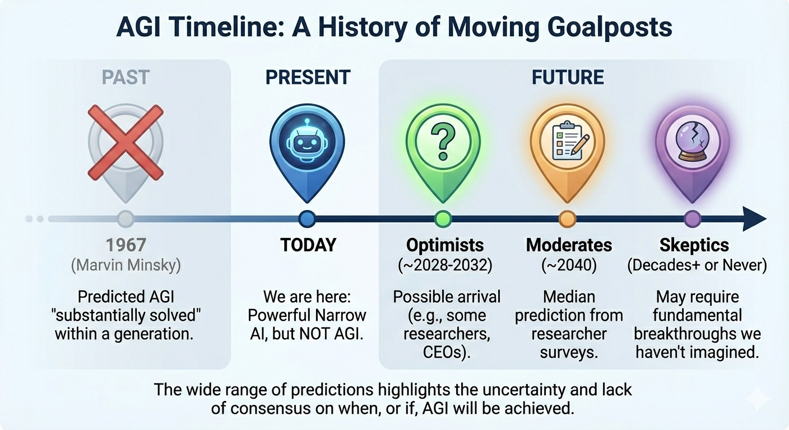

![Infographic showing AI versus AGI comparison with two main sections: on the left, icons of specialized tools including a smartphone with navigation, robotic arm with microchip, data analytics with magnifying glass, and smart speaker, labeled Specialized Tools and Todays Narrow AI; on the right, an illuminated human head profile with glowing neural network patterns representing consciousness, labeled General Intelligence and Theoretical AGI; a curved pathway in the center connects both concepts with arrows flowing between them on a soft blue gradient background](Hero.png)

## Understanding the Crucial Difference 

You've probably used AI a dozen times before breakfast today. You asked Siri to set an alarm. Google Maps found the fastest route to work. Netflix recommended a show you'd actually like. Your email app quietly filtered out spam before you even noticed it was there.

But here's where things get confusing: when people talk about AI taking over the world or achieving consciousness, they're not actually talking about the AI you use every day. They're talking about something that doesn't exist yet—something called Artificial General Intelligence, or AGI.

Let's clear up the confusion.

![Infographic titled AI vs. AGI: The Fundamental Difference with two contrasting panels separated by a large question mark labeled The Gap Is Huge; left panel has blue header reading Today's AI (Narrow/Specialized) showing four icons: smartphone with navigation app, monitor with video recommendations and shopping cart, medical scanning equipment, and face unlock symbol, with bottom text stating Highly skilled at ONE specific task. Think Specialist Tools. Cannot adapt or reason outside its domain; right panel has gold header reading Theoretical AGI (General Intelligence) displaying a robot with glowing purple core surrounded by interconnected bubbles containing icons for Learning & Reasoning (book), Strategy (chess piece), Creativity (music note), Programming (code brackets), and Ethical Understanding (handshake), with bottom text stating Can think, learn, and reason across ANY task. Think Human-Level Mind. Understands context and meaning; design uses clean modern style with soft gradients emphasizing the vast conceptual difference between current narrow AI applications and hypothetical general intelligence](AI_Vs_AGI_FundamentalDifference.jpg)

## What AI Really Means Today

Think of today's AI systems as incredibly talented specialists. They're like Olympic athletes who've trained their entire lives to do one thing extraordinarily well—but ask them to do something else and they're completely lost.

Your spam filter is brilliant at spotting junk mail. It analyzes patterns, learns what spam looks like, and catches it before it reaches your inbox [1]. But that same AI couldn't tell you what's in a photo, recommend a good restaurant, or play chess. It has one job, and it does that job really well.

This is what experts call "narrow AI" or "specialized AI." It's what powers most of the AI applications we encounter daily:

**Navigation and Travel:** When you open Google Maps or Waze, AI processes live traffic data, analyzes patterns, and suggests the fastest route [2]. It factors in accidents, construction, and even predicts where traffic jams will form. But this same AI can't help you write an email or identify a song.

**Shopping and Entertainment:** Netflix analyzes your viewing habits to recommend shows. Amazon suggests products based on your browsing history [3]. Spotify creates personalized playlists. Each system is phenomenal at its specific task but can't do the others' jobs.

**Healthcare:** AI systems can analyze medical images like X-rays and MRIs to help doctors spot diseases [4]. These systems have been trained on millions of medical scans and can often detect patterns human eyes might miss. But they can't diagnose based on a patient's symptoms or recommend treatment plans—they do one specific analytical task.

**Your Phone:** Face unlock on your smartphone uses AI that has mapped your facial features and can recognize you instantly [5]. But it can't answer your questions, translate languages, or control your smart home—that requires different AI systems.

![Infographic titled Everyday Examples of Narrow AI: Masters of One Trade, displaying four quadrants with illustrations and descriptions: Navigation & Travel section shows smartphone with map pin and car icon, text reads Suggests fastest routes by processing live traffic patterns and data; Shopping & Entertainment section shows computer monitor with play button and shopping cart, text reads Recommends shows & products based on your viewing and browsing history; Healthcare Analysis section shows medical imaging equipment with magnifying glass, text reads Analyzes medical images to help doctors spot disease patterns; Your Phone Security section shows facial recognition with lock icon and person, text reads Instantly recognizes your unique facial features to unlock your device; bottom text states Each system excels at one specific, optimized task but cannot perform the others. They are specialized tools, not thinking machines; overall design uses blue tones with white content boxes](AI_Vs_AGI_EveryExamples.png)

Here's the key point: every single one of these AI applications excels at one specific task because it was designed, trained, and optimized for exactly that purpose. They're tools, not thinking machines.

## The Different Flavors of Today's AI

To understand why AGI is different, it helps to know what kinds of AI actually exist right now.

**Traditional AI** operates on clear rules. Think of it like following a recipe—if you encounter situation A, do action B. Early chess programs worked this way. They followed sophisticated rules about good moves, but they were still following predetermined logic [6].

**Machine Learning AI** learns from data instead of following explicit rules. Your email spam filter learns by analyzing thousands of examples of spam and legitimate emails. Over time, it gets better at telling the difference. But it only learns about email classification—nothing else [7].

**Generative AI** creates new content based on patterns it has learned. ChatGPT can write essays, DALL-E can create images, and other systems can compose music. They're mimicking patterns they've seen in their training data, producing outputs that seem creative. However, they don't truly understand what they're creating [8]. As one expert put it, generative AI is "like a highly skilled parrot" that can produce impressive results without genuine comprehension [9].

All of these AI types share something crucial: they're specialized. They do what they were trained to do and nothing else.

## So What Would AGI Actually Be?

Here's where we enter theoretical territory.

AGI—Artificial General Intelligence—would be AI that can think, learn, and reason across any intellectual task, just like a human can [10]. It wouldn't just be good at one thing; it would understand and tackle problems across completely different domains without needing to be specifically programmed or trained for each one.

Imagine a single AI system that could:
- Read a medical research paper and understand the implications
- Then switch to analyzing financial markets and making investment decisions
- Then learn to play a new video game it's never seen
- Then have a philosophical discussion about ethics
- Then fix bugs in computer code
- Then create an original piece of music

And crucially, it would understand the context and meaning behind all of these tasks, not just pattern-match its way through them [11].

That's the dream of AGI. A machine with human-level intelligence that could learn and adapt to virtually anything, bringing not just computational power but genuine understanding and reasoning to any problem.

## Why Don't We Have AGI Yet?

If AI is advancing so rapidly, why haven't we achieved AGI? The answer reveals just how far we still have to go.

![Infographic titled The Path to AGI: Major Hurdles Remain showing a winding blue pathway from left to right connecting Current Narrow AI (Specialized Tools) to AGI (Human-Level Intelligence) depicted as a glowing futuristic city; three main obstacles illustrated along the path: first, a confused robot with thought bubbles containing There somenous not sentence and In ambiguous meaning, labeled 1. Understanding Context with subtitle Grasping meaning beyond simple pattern matching is still unsolved; second, a chess piece on a business flowchart with a rejected robot in a thought bubble showing people at a meeting, labeled 2. Generalization & Transfer Learning with subtitle Applying knowledge from one domain to completely different situations is difficult; third, a low-power battery warning with servers and databases, labeled 3. Resource & Hardware Limits with subtitle Enormous computational power and vast amounts of diverse data are required; overall tone conveys significant technical challenges aheadbetween them on a soft blue gradient background](AI_Vs_AGI_Hurdles.png)

**Understanding Context Is Hard:** Current AI can process information, but it doesn't truly understand context the way humans do. A language model might write a grammatically perfect essay without comprehending what the words actually mean. Teaching machines to grasp context—to connect information across different domains intuitively—remains an unsolved problem [12].

**We Don't Even Agree on What Intelligence Is:** Here's a philosophical puzzle: if we can't precisely define human intelligence, how can we replicate it in machines? Different fields—neuroscience, psychology, philosophy—have competing theories about what makes us intelligent. Should we mimic how human brains work biologically, or should we create entirely different architectures [13]?

**Generalization Is the Real Challenge:** Humans are remarkably good at taking knowledge from one area and applying it to completely different situations. We call this transfer learning or generalization. Current AI systems struggle with this. A chess AI that masters one version of chess can't easily adapt to chess with different rules, let alone transfer its strategic thinking to business decisions or military tactics [14].

**Hardware and Resource Limitations:** Creating AGI would require enormous computational resources and vast amounts of diverse data [15]. Even with today's powerful computers, we may need fundamental breakthroughs in both hardware and algorithms.

## The Timeline Problem: When Will AGI Arrive?

Here's where things get really interesting—and messy. Experts have been predicting the arrival of AGI for decades, and they've consistently been wrong.

In 1967, AI pioneer Marvin Minsky predicted that within a generation, the problem of creating artificial intelligence would "substantially be solved." That was 57 years ago [16].

Today, predictions are all over the map:

- **The Optimists:** OpenAI CEO Sam Altman suggests AGI could arrive by 2028 [17]. Some AI researchers predict development between 2027 and 2032 [18].

- **The Moderates:** A 2023 survey of AI researchers found the median prediction for AGI was around 2040 [19].

- **The Skeptics:** Other experts, like neuroscience professor Gary Marcus, argue that AGI might be decades away or potentially never achievable with current approaches [20]. Some believe it requires fundamental scientific breakthroughs we haven't even imagined yet.

The wide disagreement isn't just about technical progress—it's about what AGI even means. Some experts define AGI as "a system that can automate the majority of economically valuable work," while others insist on requiring human-like reasoning and consciousness [21]. When the goalposts keep moving, predicting the timeline becomes nearly impossible.

What's clear is that we're still firmly in the age of narrow AI. Recent advances in AI have been remarkable, but they're advances in specialized intelligence, not general intelligence.

## Why This Distinction Matters

Understanding the difference between AI and AGI isn't just academic nitpicking—it has real implications for how we think about the technology shaping our lives.

**Realistic Expectations:** When you hear about "AI" in the news, it's usually narrow AI solving specific problems. Understanding this helps you evaluate claims more critically. Is this genuinely revolutionary, or is it another specialized tool being overhyped?

**Addressing the Right Concerns:** Current AI systems pose genuine challenges: bias in algorithms, privacy concerns, job displacement in specific sectors, and questions about transparency and accountability. These are important issues, but they're different from existential questions about superintelligent machines—which remain theoretical.

**Appreciating What We Have:** Today's AI is genuinely transformative, even without being general intelligence. It's improving healthcare diagnoses, making transportation safer, accelerating scientific research, and helping businesses operate more efficiently [22]. By 2030, AI could automate up to 30% of certain professional tasks, freeing humans for more creative and strategic work [23].

**Preparing Appropriately:** If AGI does arrive, it would represent a fundamentally different technology than what we have today. It would require entirely new frameworks for governance, ethics, and integration into society [24]. But we can't let speculation about AGI prevent us from addressing the real challenges and opportunities of today's AI.

## The Bottom Line

The AI you interact with today is powerful, useful, and increasingly integrated into daily life—but it's fundamentally specialized. Each system has been carefully designed and trained for specific tasks. None of these systems are close to the flexible, general intelligence that humans possess.

AGI remains a theoretical concept. It's the subject of active research and genuine debate, but it doesn't exist yet. When someone talks about AI "thinking" or "understanding" in human terms, they're either being imprecise with language or they're talking about AGI—which is still firmly in the future, whether that future is 5 years or 50 years away.

As AI technology continues advancing, the gap between specialized AI and general AI will remain one of the most important distinctions to understand. Today's AI is already remarkable and transformative. AGI would be something else entirely—a leap as significant as the difference between a pocket calculator and a human mathematician.

For now, the AI in your pocket can navigate your commute, filter your email, and recommend your next favorite show. It's specialized, it's powerful, and it's not going to suddenly wake up and start thinking like a human. And honestly, that's already pretty impressive.

---

## References

[1] GeeksforGeeks. "Uses of Artificial Intelligence in Everyday Life". https://www.geeksforgeeks.org/artificial-intelligence/10-examples-of-artificial-intelligence-in-real-life-2024/. Retrieved December 2024.

[2] LitsLink. "AI in Everyday Life: 15 Surprising Examples". https://litslink.com/blog/non-obvious-ai-examples-in-your-daily-life. Retrieved December 2024.

[3] Numerous.ai. "15 Examples of AI in Everyday Life". https://numerous.ai/blog/examples-of-ai-in-everyday-life. Retrieved December 2024.

[4] Daffodil Software. "20 Uses of Artificial Intelligence in Day-to-Day Life". https://insights.daffodilsw.com/blog/20-uses-of-artificial-intelligence-in-day-to-day-life. Retrieved December 2024.

[5] Formaloo. "AI examples in everyday life: 10 uses you didn't know existed!". https://www.formaloo.com/blog/ai-examples-in-everyday-life-10-uses-you-didnt-know-existed. Retrieved December 2024.

[6] Bernard Marr. "The Crucial Difference Between AI And AGI". https://bernardmarr.com/the-crucial-difference-between-ai-and-agi/. Retrieved December 2024.

[7] Tableau. "Everyday examples and applications of artificial intelligence (AI)". https://www.tableau.com/data-insights/ai/examples. Retrieved December 2024.

[8] PWSkills. "7 Generative AI Applications In Daily Life". https://pwskills.com/blog/generative-ai-applications/. Retrieved December 2024.

[9] Bernard Marr. "The Important Difference Between Generative AI And AGI". https://bernardmarr.com/the-important-difference-between-generative-ai-and-agi/. Retrieved December 2024.

[10] USAII. "Artificial General Intelligence (AGI): Challenges & Opportunities Ahead". https://www.usaii.org/ai-insights/artificial-general-intelligence-challenges-and-opportunities-ahead. Retrieved December 2024.

[11] Bernard Marr. "The Crucial Difference Between AI And AGI". https://bernardmarr.com/the-crucial-difference-between-ai-and-agi/. Retrieved December 2024.

[12] Bernard Marr. "The Important Difference Between Generative AI And AGI". https://bernardmarr.com/the-important-difference-between-generative-ai-and-agi/. Retrieved December 2024.

[13] USAII. "Artificial General Intelligence (AGI): Challenges & Opportunities Ahead". https://www.usaii.org/ai-insights/artificial-general-intelligence-challenges-and-opportunities-ahead. Retrieved December 2024.

[14] Wikipedia. "Artificial general intelligence". https://en.wikipedia.org/wiki/Artificial_general_intelligence. Retrieved December 2024.

[15] IAS Express. "Artificial General Intelligence Explained: Timeline, Risks, Jobs & Global Impact". https://www.iasexpress.net/artificial-general-intelligence-explained-timeline-risks-jobs-global-impact/. Retrieved December 2024.

[16] Wikipedia. "Artificial general intelligence". https://en.wikipedia.org/wiki/Artificial_general_intelligence. Retrieved December 2024.

[17] DataCamp. "Artificial General Intelligence (AGI): Predictions, Risks, Challenges". https://www.datacamp.com/blog/agi. Retrieved December 2024.

[18] USAII. "Artificial General Intelligence (AGI): Challenges & Opportunities Ahead". https://www.usaii.org/ai-insights/artificial-general-intelligence-challenges-and-opportunities-ahead. Retrieved December 2024.

[19] AI Multiple. "When Will AGI/Singularity Happen? 8,590 Predictions Analyzed". https://research.aimultiple.com/artificial-general-intelligence-singularity-timing/. Retrieved December 2024.

[20] DataCamp. "Artificial General Intelligence (AGI): Predictions, Risks, Challenges". https://www.datacamp.com/blog/agi. Retrieved December 2024.

[21] ARC Prize. "What is ARC-AGI?". https://arcprize.org/arc-agi. Retrieved December 2024.

[22] AIT Global. "Top AI Examples in Everyday Life: How AI Impacts You Daily". https://aitglobalinc.com/ai-ml/ai-examples-in-everday-life/. Retrieved December 2024.

[23] Bernard Marr. "The Crucial Difference Between AI And AGI". https://bernardmarr.com/the-crucial-difference-between-ai-and-agi/. Retrieved December 2024.

[24] IAS Express. "Artificial General Intelligence Explained: Timeline, Risks, Jobs & Global Impact". https://www.iasexpress.net/artificial-general-intelligence-explained-timeline-risks-jobs-global-impact/. Retrieved December 2024.

---