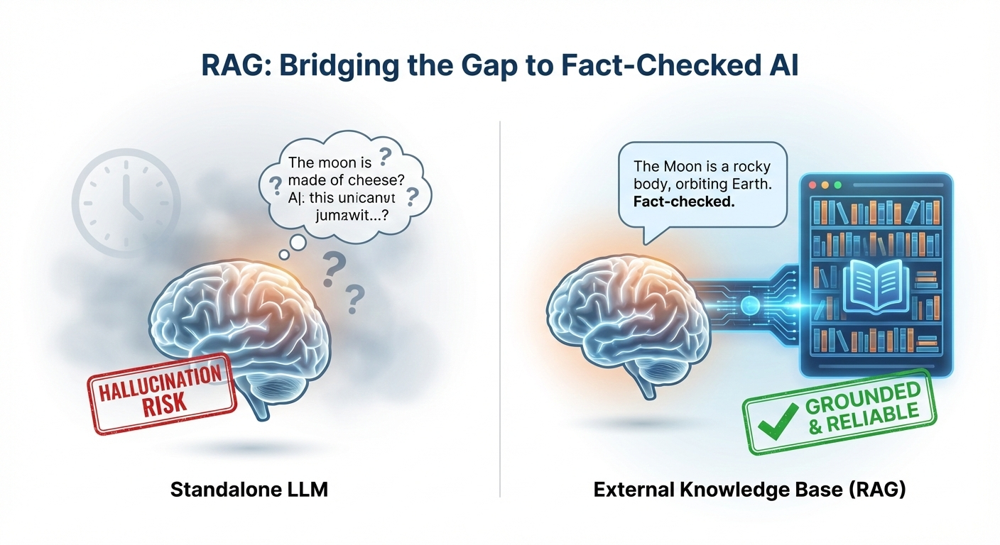

## Introduction: The Hallucination Problem & RAG's Promise

Ever engaged with a chatbot, posing a seemingly simple query, only to be met with an answer that, while delivered with unwavering confidence, is demonstrably false? Or perhaps the information feels…anachronistic, as if plucked from the digital archives of a bygone era? Such are the vagaries of Large Language Models (LLMs). These marvels of modern engineering, capable of generating text that often blurs the line between human and machine, are nonetheless prone to lapses in memory, moments of confusion, and, most disconcertingly, the outright fabrication of plausible-sounding nonsense—what we've come to term "hallucinations."

LLMs, for all their brilliance, possess limitations. They are, at their core, vast repositories of patterns gleaned from the data upon which they were trained. But data ages, contexts shift, and the world, as always, marches relentlessly forward. What then, is the remedy for this inherent fallibility?

Enter Retrieval Augmented Generation (RAG). Think of it as bestowing upon your LLM the combined virtues of a tireless research assistant and an incorruptible fact-checker. RAG empowers these models to venture beyond the confines of their pre-existing knowledge, to actively seek out and incorporate relevant information from the vast expanse of the external world.

![Flowchart diagram illustrating how LLM knowledge limitations lead to unreliable outputs. Left panel shows a brain icon labeled LLM (Pre-trained) with a calendar icon indicating Knowledge Cutoff: 2023. Two arrows point from the LLM to middle panels: top arrow leads to a document icon labeled Outdated Information, bottom arrow leads to a thought cloud with question marks labeled Fabricated Nonsense (Hallucination). Both middle panels have arrows pointing to a right panel containing a red X symbol labeled Unreliable Output. Below the diagram, text reads: Without live data, LLMs can confidently generate incorrect or obsolete answers. The diagram uses a muted color palette with light blue backgrounds and conveys a cautionary tone about AI limitations.](RAG_Knowledge_Gap_and_Hallucinations.png)

In this exploration, we will delve into the essence of RAG, tracing its origins, examining its present-day significance, acknowledging the challenges it faces, and pondering the directions in which it may evolve.

## RAG Explained: The Brains Behind the Smarter AI

At its heart, RAG is an architectural framework designed to augment LLMs by enabling them to consult external knowledge sources.

Consider the following analogy: Imagine a meticulous librarian (the retriever), possessing an encyclopedic knowledge of available resources, capable of swiftly locating the precise tome required to address a specific query. This librarian then presents the relevant text to a gifted writer (the generator, or LLM), who, drawing upon their linguistic prowess and the newly acquired information, crafts a comprehensive, factually grounded response. This, in essence, is the power of RAG.

![Infographic process flow diagram showing five circular stages of RAG system operation connected by arrows from left to right. Stage 1 User Query shows a person with question mark speech bubble. Stage 2 Retriever (Librarian) Searches External Knowledge depicts a librarian with magnifying glass examining servers and books. Stage 3 Relevant Context Extracted shows a hand holding multiple document pages. Stage 4 Generator (LLM/Writer) Crafts Response with Context illustrates a person writing with a brain icon above. Stage 5 Grounded, Fact-Checked Answer displays a document with checkmark badge and fact-checked stamp. The background gradient transitions from blue through teal to green, visually representing the progression from question to verified answer.](How_RAG_works.png)

Let's dissect the process:

1. A question is posed.
2. RAG initiates a rapid search across a multitude of external knowledge bases. This could encompass a company's internal documentation, a collection of scholarly articles, or the entirety of the indexed web.
3. The system identifies and extracts the most pertinent pieces of information.
4. Both the original question and the retrieved information are presented to the LLM.
5. The LLM, armed with this fresh context, formulates an answer that is not only more accurate and up-to-date but also more tailored to the specific nuances of the inquiry.

The key benefits of RAG are threefold: a marked reduction in the occurrence of fabricated information (hallucinations), access to the most current knowledge available, and the ability to generate highly specific and contextually relevant responses.

## RAG Today: The Unsung Hero Making AI Practical

The AI community is currently abuzz with excitement surrounding RAG. It is increasingly viewed as a "pivotal" and "transformative" technology, one that holds the key to making AI truly reliable and practical.

The real-world applications of RAG are diverse and compelling:

**Customer Support:** Imagine chatbots capable of providing accurate and up-to-date information regarding a company's policies and procedures, rather than relying on generic, often outdated responses (as exemplified by Siemens' implementation).

**Healthcare:** RAG can empower physicians with rapid access to the latest medical research and comprehensive patient records, facilitating more informed diagnoses and treatment plans (as demonstrated by IBM Watson Health).

**Content Creation:** Content creators can leverage RAG to ensure that their articles and other materials are grounded in the most current facts and figures (as utilized by platforms like Jasper).

**Legal Professionals:** Lawyers can employ RAG to efficiently sift through vast quantities of case law and statutes, accelerating legal research and analysis.

**Enterprise Search:** RAG can transform the way organizations access and utilize internal knowledge, enabling employees to quickly find the information they need.

The widespread appeal of RAG stems from its ability to:

- Reduce the incidence of hallucinations by grounding AI responses in verifiable data.
- Ensure that AI systems have access to the most current information available.
- Provide a cost-effective alternative to the computationally expensive process of retraining massive LLMs whenever new data emerges.
- Empower developers with greater control over the information that AI systems access and the responses they generate.
- Enhance transparency by providing users with access to the sources upon which AI responses are based.

## The Dark Side of the Moon: RAG's Headaches & Hiccups

Despite its many advantages, RAG is not without its limitations.

The principle of "garbage in, garbage out" applies. If the external data sources that RAG consults are biased, incomplete, or inaccurate, the resulting AI responses will inevitably reflect these flaws.

While RAG significantly reduces the occurrence of hallucinations, it does not eliminate them entirely. If the retrieved information is ambiguous or open to interpretation, the LLM may still "fill in the blanks" incorrectly.

The process of searching and processing external data adds latency to AI responses. In real-time applications, this delay can be problematic.

Setting up and maintaining a RAG system is a complex undertaking, requiring careful tuning and optimization of various components.

LLMs have a limited capacity to process information at any given time. If the amount of retrieved data is excessive, the LLM may struggle to identify the most relevant information.

Furthermore, RAG raises a number of ethical concerns:

**Bias:** If the data RAG accesses is biased, its answers will be too.

**Privacy:** Handling sensitive user data with external sources means big privacy and security concerns.

**"Illusion of Credibility":** Just because RAG cites sources doesn't mean it interpreted them correctly. Users might blindly trust it.

**Intellectual Property:** Who owns the content RAG uses to generate answers? Legal battles waiting to happen.

## Future Forward: Where RAG is Roaming Next

![Two-section infographic displaying RAG benefits and future capabilities. Top section titled RAG Today: Key Benefits shows four blue-bordered boxes with icons: Reduced Hallucinations (shield with ghost and X symbol), Always Up-to-Date (clock with circular arrows), Cost-Effective Training (stacked database coins with downward arrow), and Enhanced Transparency (open book with magnifying glass). Bottom section titled RAG Future: Evolving Capabilities shows three purple hexagonal boxes: Multimodal with text/image/audio icons, Real-Time Data Streams with live streaming and globe icons, and Autonomous AI Agents with robot and speech bubble icons. The design uses a clean, professional style with consistent iconography and a light background.](RAG_today.png)

The future of RAG is brimming with possibilities.

Imagine RAG systems capable of processing not only text but also images, audio, and video (Multimodal RAG).

Envision AI systems that receive real-time updates from live data feeds, enabling them to respond to dynamic events with even greater accuracy and immediacy.

Consider RAG empowering AI agents to not only answer questions but also to plan and execute complex tasks autonomously.

Picture RAG running on local devices or private clouds, tailoring AI responses to individual users while safeguarding their privacy.

Expect RAG to continue blurring the line between human and machine, enabling AI systems to generate responses that are increasingly nuanced and insightful.

Researchers are continually refining RAG's retrieval mechanisms, its interaction with LLMs, and its overall performance. The ultimate goal is to create AI systems that are even more robust, adaptable, and trustworthy.

## Conclusion: RAG - The Backbone of Reliable AI

RAG represents more than just a passing technological trend; it is a fundamental building block for creating AI systems that are genuinely useful and trustworthy.

By bridging the gap between static knowledge and dynamic, real-world information, RAG is unlocking the true potential of LLMs.

While challenges remain, RAG is poised to shape the future of AI for the better, making it smarter, more factual, and far less prone to fabrication. The journey is just beginning, and the possibilities are vast.

---

*Published on Signal Over Noise - Cutting through tech hype with two decades of perspective.*
